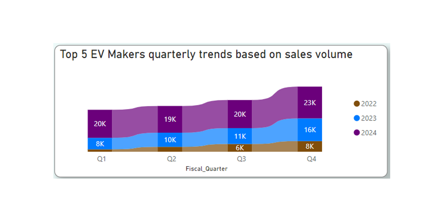
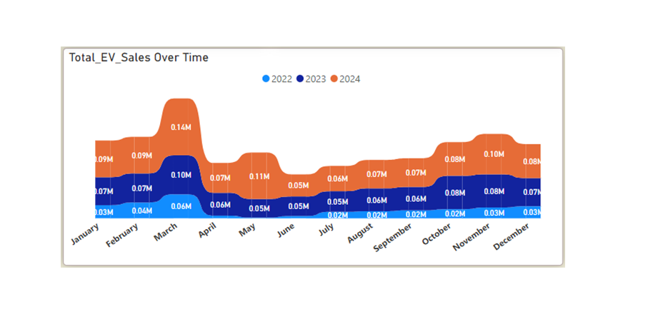

# **AtliQ Motors Data Analysis Project Codebasics Resume Challenge 12  (Unguided Project)** 
## Author:          Aftab Ahmad
## Date:            18 December, 2024
## Contact:         aftabajk@gmail.com

## **``Introduction``**:
**AtliQ Motors** is an automotive giant from the USA specializing in electric vehicles (EV). Their market share in North America's electric and hybrid car segment increased to 25% over the previous five years. They intended to introduce their best-selling models in India, where their market share is less than 2%, as part of their expansion plans. Before moving further, Bruce Haryali, the CEO of AtliQ Motors India, wants to do a thorough market analysis of the country's current EV/Hybrid industry. As part of AtliQ Motors' strategic expansion plans, I conducted a comprehensive market analysis of the Indian electric vehicle (EV) industry. To facilitate data analysis and visualization throughout this process, I utilized Microsoft Power BI as my primary tool.

## **``Objectives``**:
AtliQ Motors aims to expand its market share in India’s rapidly growing EV sector. To do so, a comprehensive analysis of the current market landscape, key growth trends, and sales data by region and category is needed to uncover actionable insights and strategic recommendations.

### **Stakeholders**:
The stakeholders for this comprehensive market research report are as follows:

- **Bruce Haryali** Chief of AtliQ Motors India, who requires a thorough market study of the existing EV and hybrid vehicle market in India to inform future strategic initiatives.
- **Data Analytics Team at AtliQ Motors** responsible for gathering, analyzing, and interpreting market data to provide actionable insights and support the objectives of this study.

## **``Data Source``**:
The dataset has been sourced from the Codebasics website in partnership with their collaborator, who provides open access to the public for data analysis and insight generation, making it a valuable educational resource. You can access the data [here](https://codebasics.io/challenge/codebasics-resume-project-challenge). I have obtained additional data to support and broaden the scope of this analysis.

## **``Data Description``**:
The dataset for this project comprises three CSV files: (1) Date Dimension Table, (2) Electric Vehicle Sales by Manufacturer, and (3) Electric Vehicle Sales by State. Covering a period from March 1, 2021, to March 31, 2024, the data spans three consecutive years and is structured to align with the Indian fiscal year, which runs from April 1 to March 31. The data is organized to facilitate analysis for extracting meaningful insights.
## **``Data Exploration``**:
I collected three data files in comma-separated tab format. In the 'Electric Vehicle Sales by State' file, I identified inconsistencies, as one column was contracted and requires splitting into multiple columns. Additionally, the Date Dimension table is organized by calendar year.  I need to transform it to align with the Indian fiscal year for more accurate and meaningful insights.
## **``Data Cleaning``**:
I performed data transformation operations, including tasks such as splitting data into distinct columns, such as date, vehicle category, state name, electric vehicles sold, and total vehicles sold. Additionally, to ensure data integrity and accuracy, I thoroughly examined the dataset, confirming that there are no duplicate values. 
## **``Data Modeling``**
Data modeling in Power BI is a highly effective initial approach for deriving data-driven insights, providing a clear framework for aligning data to generate actionable results. The star schema and snowflake schema techniques in Power BI enhance data handling capabilities and improve overall efficiency. As previously mentioned, I was provided with three tables. After developing a comprehensive understanding of the data, I established a one-to-many relationship between the dim_date table and the sales-by-state table by linking the date columns. I also created a connection between the dim_date table and the sales-by-maker table. Subsequently, I incorporated an additional table containing data on public charging stations for electric vehicles, which further supported our data analysis process.

## **``Data Analysis``**
I conducted a comprehensive analysis using Powerbi to address the primary and secondary questions posed by the stakeholders. During this process, I identified several key insights that were instrumental in answering these critical questions.

### Top 3 and bottom 3 makers for the fiscal years 2023 and 2024.

The analysis focuses on the ranking of the top three and bottom three manufacturers based on the number of electric 2-wheelers sold during each fiscal year.

**Top Manufacturers**:

**OLA Electric** consistently led the market, selling 0.15 million units in FY 2023 and increasing to 0.32 million units in FY 2024. This represents an impressive growth rate of **113.33%**, indicating that sales in FY 2024 more than doubled compared to the previous fiscal year.
In FY 2023, **Okinawa** held the second position with 0.01 million units sold, followed by **Hero Electric** in third place. However, the rankings shifted in FY 2024, with **TVS** claiming the second spot by selling 0.18 million units, while **Ather** emerged as the third-largest seller.

**Bottom Manufacturers**:

In FY 2023, the bottom three performers were **Pure EV** (11.6K units), **Being** (11.0K units), and **Jitendra** (8.6K units).
The ranking changed in FY 2024, with **Kinetic Green** at the bottom, selling 9.6K units, followed by **Revolt** with 7.3K units, and **Battere Electric** with 4.8K units.

###  Top 5 states with the highest penetration rate in 2 & 4-wheelers EV sales in FY 2024.

Stakeholders want to understand regional adoption trends of electric vehicles (EVs) by identifying the states where EV sales have gained significant traction relative to the total market. Specifically, they are interested in Market Penetration Insights. 

In FY 2024, **Kerala** led the penetration rates for 4-wheelers at 5.76%, followed by **Chandigarh** (4.50%), **Delhi** (4.29%), **Karnataka** (4.26%), and **Goa** (4.25%). **Goa** topped the list for 2-wheeler penetration rates at 17.99%, with **Kerala** at 13.52%, **Karnataka** at 11.57%, **Maharashtra** at 10.07%, and **Delhi** at 9.40%.
**Kerala**, **Goa**, and **Delhi** featured prominently among the top five states for penetration rates in both 2-wheelers and 4-wheelers, highlighting their strong adoption of personal vehicles.

###   States with Negative Penetration.

To identify states with negative penetration rates (low or declining sales adoption) for electric vehicles (EVs) in India, stakeholders focus on several key objectives. These include: 
**Identifying Market Gaps and Growth Opportunities**, **Policy Effectiveness and Need for Interventions**, **Infrastructure Planning** and **Competitive Strategy for Manufacturers**. 

States with negative EV penetration rates include **Andaman & Nicobar Islands**, **Gujarat**, **Haryana**, **Himachal Pradesh**, **Jharkhand**, **Rajasthan**, and **Uttarakhand**. Notably, Gujarat and Rajasthan stand out as challenging cases, as they reported high EV sales during the analyzed period despite declining penetration rates. This paradox underscores the complexity of addressing regional EV adoption dynamics and poses unique challenges for stakeholders in these markets.

###   Quarterly Sales Volume Trends for Top 5 EV Makers (4-Wheelers).

Stakeholders can achieve several objectives through the analysis of quarterly sales volume trends. This includes identifying seasonality, understanding demand patterns, and evaluating the impact of external factors such as festivals or changes in government policies. Furthermore, this analysis facilitates the comparison of performance among the top five EV manufacturers, aiding in benchmarking and competitive assessment. It also supports production planning, inventory management, and supply chain optimization, providing critical insights for strategic decision-making. Notably, the data indicates that EV sales consistently peak in Quarter 3 and Quarter 4 over the analyzed period.

###   Top 5 Manufacturer By Revenue.

Upon analysis, it was observed that **Tata Motors** consistently recorded the highest quarterly sales volume among the top five EV manufacturers, followed by **Mahindra & Mahindra** and **MG Motor**. On the other hand, **BYD India** and **Hyundai Motor** reported comparatively lower quarterly sales volumes within this group.

###   Comparing EV Sales and Penetration Rates in Delhi and Karnataka for 2024.

Comparing EV sales and penetration rates between Delhi and Karnataka for 2024 serves multiple objectives. It helps understand regional differences in EV adoption between two significant markets, allowing stakeholders to evaluate which state has achieved a higher level of market penetration and leads in EV adoption. Both regions are key destinations for EV growth due to their unique characteristics.

Delhi, as the capital city, reflects the effectiveness of government policies such as subsidies, tax exemptions, and advancements in charging infrastructure, highlighting its role as a center of green mobility initiatives. On the other hand, Karnataka, known for its EV manufacturing hub and progressive policy framework, demonstrates how industrial initiatives influence sales and penetration rates.

The analysis reveals that **Karnataka** outperforms **Delhi** in both penetration rate and EV sales volume. Karnataka achieved EV sales of 161,000 units with a penetration rate of 10.18%, while Delhi recorded sales of 47,000 units with a penetration rate of 7.71%. This indicates Karnataka's leadership in driving EV adoption through a combination of policy, infrastructure, and industry-focused strategies.

###   Compound Annual Growth Rate (CAGR) for Top 5 EV Makers (4-Wheelers) from 2022 to 2024.

Stakeholders want to understand how each of the top 5 EV manufacturers in the 4-wheelers segment has grown over the period they also want to determine which manufacturer have experienced the highest growth, indicating strong market demand and successful business strategies. Analysts often compare the compounded annual growth rate (CAGR) of the brands to identify the leaders and laggards in the market.

Over the analyzed period, **Tata Motors** leads in terms of sales volume but records a CAGR of 94.71%, followed by **Mahindra & Mahindra** with 140.33%, and **MG Motor** with 131.53%. However, **BYD India** and **Hyundai Motor**, ranked 4th and 5th respectively, exhibit significantly higher growth rates, with 566.52% and 255.48% CAGR. This trend highlights a rapidly evolving competitive landscape in the Indian EV market. The higher CAGR of the 4th and 5th ranked manufacturers signals their aggressive expansion and ability to capture market share. For market leaders, this underscores the need to innovate and adapt to maintain their dominance. Meanwhile, the rising players are capitalizing on opportunities to challenge the status quo.

Such dynamics foster a competitive and vibrant EV market, ultimately benefiting consumers through improved choices, innovation, and accelerated market growth.

###   Top 10 states with the highest Compound Annual Growth Rate (CAGR) in total vehicle sales.

Identifying the top 10 states with the highest CAGR enables stakeholders to uncover growth opportunities, craft targeted strategies, and optimize investments, providing insights into the EV market's trajectory and actions needed to sustain its momentum.

Among the top 10 sates with higher CAGR in total sales we find interesting insights as mostly states with low sales volume have the higher compound annual growth rate. States with low sales volume have the higher compound annual growth rate includes Meghalaya is at the top with 28.47% CAGR followed by Goa with 27.41% and Karnataka with 25.28%. Possible reasons for highest CAGR with low sales volume could be as follows.

- The highest CAGR States with low initial sales volumes require relatively fewer absolute sales to achieve significant percentage growth, leading to a higher CAGR.
- These states may represent emerging markets where EV adoption is just beginning to gain traction, fueled by increasing awareness or recent infrastructure development.
- New charging stations or localized policy efforts might target these regions, boosting adoption rates.
- The availability of affordable EV options and financing solutions can rapidly accelerate sales in these regions.

###   Peak and Low season months for EV Sales from 2022 to 2024.

Stakeholders seek to understand seasonal trends in EV sales by identifying peak and low-performing months from 2022 to 2024. This analysis helps uncover patterns influenced by factors such as festivals, weather, or other external events. The insights can aid in forecasting future demand, optimizing production schedules, and streamlining inventory and supply chain management. Additionally, these findings enable stakeholders to establish a strategic framework, encouraging manufacturers and dealers to allocate resources and staff more effectively to adapt to market fluctuations during peak and low-demand periods.

In the year 2022 above, average sales trends is observed in 3rd and 4rth quarters as Peak season months are January, February and March and low seasons month i.e below average months of EV sales are April to September in the context of Indian Fiscal year. In the year 2023  October, November and March as peak season months while May, June, and July remain low season months.  In the year 2024 May, November and March are the peak season months while July and July remains low seasons month. 
Over a three-year period, **March** consistently emerges as the peak month, while **June** represents the low season month.

### Projected 2030 EV sales for the top 10 states by penetration rate, based on historical CAGR.

Stakeholders aim to find the top 10 states with the highest EV penetration rate, which means regions where electric vehicles make up a significant proportion of vehicle sales. To project EV sales by 2030 using the historical Compound Annual Growth Rate (CAGR) which provides a consistent rate to estimate future trends based on past performance.

The estimation of projected EV sales for 2030 positions **Maharashtra** at the top of the list with an anticipated 13.35 million units sold by the end of the year. **Kerala** follows with 11.78 million, and **Gujarat** ranks third with 8.65 million. Other notable states include **Karnataka** with 8.38 million, **Odisha** with 2.73 million, **Goa** with 2.42 million, **Rajasthan** with 2.4 million, **Tamil Nadu** with 1.58 million, **Delhi** with 1.05 million, and **Chandigarh** with 0.99 million unites.

These projections underscore Maharashtra, Kerala, and Gujarat as high-growth regions, presenting significant opportunities for investments in EV-related sectors such as charging infrastructure, manufacturing, and supply chain development. These insights provide stakeholders with valuable guidance for formulating strategic initiatives in production, marketing, and operational planning to capitalize on emerging market opportunities.

###   Revenue growth rate of 4W & 2W EVs in India for 2022 vs 2024 and 2023 vs 2024.

Stakeholders seek to understand market dynamics by analyzing how revenue growth evolves over time in the 2-wheeler and 4-wheeler EV segments. Growth rate insights enable informed decision-making on resource allocation, such as prioritizing investments between segments, scaling production, or expanding market presence.

The estimated revenue growth rate for 2022–2024 is higher than that for 2023–2024. This trend suggests that the EV market experienced rapid growth during the initial years (2022–2023), likely driven by factors such as increasing adoption, favorable policy incentives, and the entry of new market players. Additionally, potential changes in policies, subsidies, or economic conditions between 2022 and 2024 may have influenced this pattern.

It is also possible that specific segments, such as 2-wheelers or particular regions, reached saturation faster than others, contributing to the observed deceleration in growth. These insights highlight the importance of strategic planning to sustain market momentum and capitalize on emerging opportunities.

## Secondary Research Questions:

###   Correlation of charging stations infrastructure with the EV sales and penetration rates.

Stakeholders want to find Correlation of charging stations infrastructure with the EV sales and penetration rates 
to analyze the relationship between infrastructure development and the success of the EV market in key regions.

It is evident that the growth of infrastructure is a key factor likely to drive an increase in electric vehicle (EV) sales and adoption. **Analyzing the correlation between EV sales and the availability of public charging stations in the top five states with the highest EV sales volumes revealed a positive correlation**. As the number of public charging stations increased, EV sales also experienced growth. However, no **positive correlation** was observed between EV penetration rates and infrastructure development, indicating that other factors may influence penetration rates beyond charging infrastructure alone.

###   Band Ambassador if AtliQ Motors.

Virat Kohli is an ideal choice as the brand ambassador for AtliQ Motors if the company launches its EV/Hybrid vehicles in India. Kohli's immense popularity across the country ensures a wide reach, resonating with diverse demographics from middle-class families to the elite class. As a global sports icon known for his dedication, discipline, and high performance, Kohli embodies the qualities of reliability and innovation that align with the aspirations of a modern automobile brand.

Moreover, Kohli's advocacy for fitness and sustainable practices makes him a natural fit for promoting environmentally friendly technologies such as EVs and hybrids. His association with AtliQ Motors would position the company as a forward-thinking, responsible brand that caters to India's growing eco-conscious audience. With his unparalleled influence on social media and his ability to inspire trust and aspiration, Kohli’s endorsement could significantly boost the visibility and credibility of AtliQ Motors, driving greater consumer interest and adoption of its vehicles.

###   State ideal to start a manufacturing unit.

Maharashtra stands out as an ideal state for establishing a manufacturing unit, particularly in the automobile sector. The state has undertaken significant reforms to enhance its business environment, as highlighted in the Business Reform Action Plan (BRAP) 2020. The Maharashtra government actively attracts investments by offering substantial incentives and subsidies, fostering a supportive ecosystem for manufacturing.

A key advantage of setting up a unit in Maharashtra is its well-developed infrastructure, including an extensive network of public charging stations. With approximately 3,092 public EV charging stations, Maharashtra leads in providing the necessary infrastructure for the production and adoption of electric vehicles. These factors, combined with a stable governance structure and ease of doing business initiatives, make Maharashtra a prime destination for manufacturing investments in India.

## **``Summary of Analysis``**:

- Ola Electric dominated the two-wheeler segment, with sales skyrocketing from 0.15 million in FY 2023 to 0.32 million in FY 2024 113% growth.
- Tata Motors has led 4-wheeler EV sales consistently from 2022 to 2024, while Kerala, Goa, and Delhi showcase strong EV adoption across both 2-wheelers and 4-wheelers. With fast-growing players like BYD and Hyundai, staying agile and adaptive is crucial for AtliQ to thrive in this competitive market.
- The analysis reveals that Karnataka outperforms Delhi in both penetration rate and EV sales volume.
- Data analysis reveals that states with lower sales volumes are experiencing higher growth rates, with Meghalaya leading the trend at an impressive 28.47% CAGR.
- Over a three-year period, March consistently emerges as the peak month, while June represents the low season month.
- Maharashtra, Kerala, and Gujarat emerge as high-growth regions, offering opportunities in EV sectors like charging infrastructure and manufacturing. These insights guide strategic planning to capitalize on the expanding market.
- By 2030, Maharashtra is projected to lead in 2-wheeler sales, while Karnataka is expected to dominate in 4-wheeler sales.

## **``Dashboard Insights``**:

### Sales Insights.

### State Analysis.

### Manufacturer Analysis.

### Trends and Insights.

## **``Recommendation``**:

- Target High-Growth States: Focus on Maharashtra, Kerala, Gujarat, and Karnataka for strategic investments in EV infrastructure, manufacturing, and market penetration, as these regions show strong growth potential.
- Capitalize on Seasonal Trends: Align product launches and marketing campaigns with the peak sales month of March and plan promotional strategies to counter the low season in June.
- Leverage Emerging Markets: Tap into states with high growth rates but lower sales volumes, like Meghalaya (28.47% CAGR), to establish an early foothold in emerging EV markets.
- Differentiate Through Innovation: Stand out in the competitive two-wheeler market by offering unique features, eco-friendly practices, or competitive pricing to attract sustainability-focused consumers.

## **``Conclusion``**:
The analysis of AtliQ Motors' electric vehicle market data highlights key trends, challenges, and opportunities in this evolving industry. By leveraging the insights derived from this report, the company can position itself to make data-driven decisions that align with market demands and organizational goals.

The recommendations outlined aim to enhance decision-making across product development, marketing strategies, and operational efficiencies. Implementing these strategies can help AtliQ Motors establish a competitive edge in the growing electric vehicle market.

I would greatly appreciate your feedback and suggestions regarding this analysis report on AtliQ Motors' electric vehicle market. Your input is invaluable in helping me refine and improve my work. Please feel free to share your thoughts by emailing me at **aftabajk@gmail.com** or connecting with me on [LinkedIn](https://www.linkedin.com/in/aftab-ahmad-data-analyst/)

